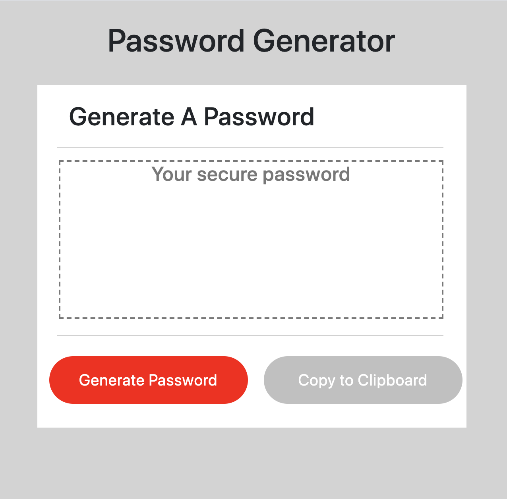

# PasswordGenerator

User Story

As an employee who has access to sensitive information, it is important to use secure passwords to protect the sensitive information so unauthorized users do not gain access. 

It is important to randomly generate passwords that meet the specific criteria for eac source of information, so that iz can create strong passwords that provide greater security.

A password generate will help create different passwords for each source of data, and make sure they are randomly generated so they can not be hacked for unauthorized users to gain access.

Business Context

For companies that handle large amounts of sensitive data, weak passwords can pose a real security threat. An application that can generate strong passwords quickly and effortlessly saves employees time and ensures secure access to data.

Acceptance Criteria

GIVEN that a user needs a new, secure password

WHEN prompted for password criteria

THEN a password is generated

link to page:
https://marciaadler.github.io/PasswordGenerator/